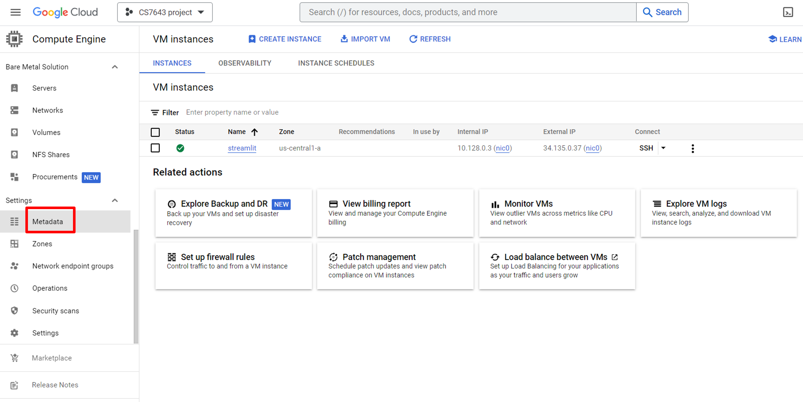

# Deploy a ML model on GCP with Streamlit
## 1. Set up a GCP VM

Go to GCP Compute Engine --> VM instances --> Create Instance

 

Set up the configuration like below, then create

 

Go to the local computer terminal, then the home directory 

<pre>cd ~</pre>

Check if there is a .ssh folder

<pre>ls .ssh</pre>

If not, make one

<pre>mkdir .ssh</pre>

Then go to the .ssh folder

<pre>cd .ssh</pre>

Generate key pairs

<pre>ssh-keygen</pre>

Open the content of the public key

<pre>cat id_rsa.pub</pre>

Copy and paste the public key in its entirety to GCP and save

 

Get the external IP address

In the local computer terminal, in the .ssh folder, enter

<pre>ssh {username}@{external ip address}</pre>

